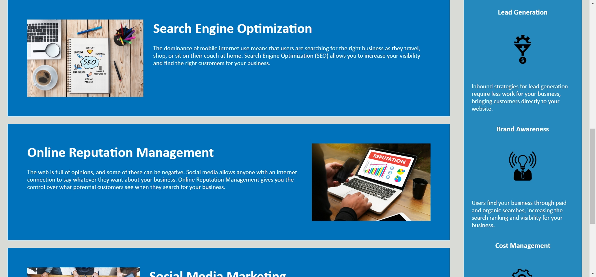
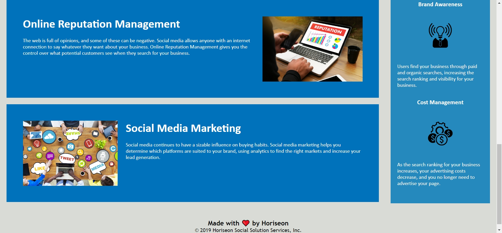
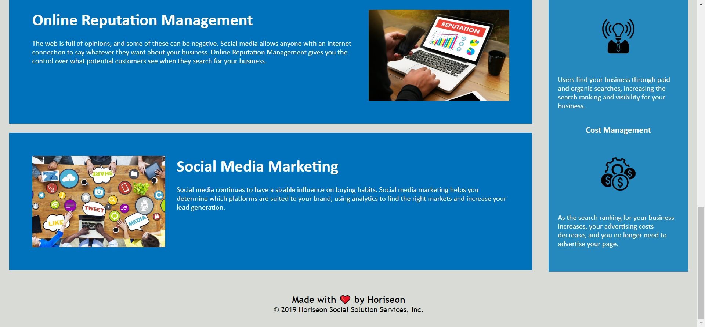

# Horiseon Sample

## Description

```
The motivation is to create a mock up of a webpage that represent Horiseon that would follow the accessibility standards and optimized for search engines for the company Horiseon.
```

```
I build this project to make it easy for accessbility for those who need to access the Horiseon website.
```

```
The problems solved would be ease of access for people who needs accessbility to Horiseon's website.
```

```
I learned that there are semantic and non-semantic tags to a modern webpage and their structure doesn't use the div tags.
```

## Changes

```
Changes includes changing most "div" tags into semantic tags such as "header", "nav", "content", and "aside". Changing the "div" tag that is the child to the "header" tag break the structure of the webpage. There is a change in the CSS file which is changing the "div" tags into nav make the webpage to its original appearance.
```

## Links

Link to repo: [GitHub Repo](https://github.com/Jasony95/horiseon-sample-html)

Link to GitHub Pages: [GitHub Pages]()

## Table of Contents

If your README is long, add a table of contents to make it easy for users to find what they need.

- [Installation](#installation)
- [Usage](#usage)
- [Credits](#credits)
- [License](#license)
- [Badges](#badges)
- [Features](#features)
- [How to Contribute](#how-to-contribute)
- [Test](#tests)

## Installation

There is no installation required but just using computer basics to get the project running and internet access:

1. Go to the repo in GitHub: [Horiseon Mock Up in GitHub](https://github.com/Jasony95/horiseon-sample-html)

2. Click on the green button that has the text "<> Code".

3. Go to the where you downloaded the Zipped folder.

4. Unzip the folder.

5. Open the files with a code editor.

6. To see the webpage, open the "index.html" file with an internet browser.

## Usage

The homepage should look like: 

The functions of the webpage includes directing you to a part of the webpage depending on which text you click on at the upper top right corner of the webpage:

1. Clicking on "Search Engine Optimization" on the upper right corner will direct you to a part of the webpage:


Which will take you to this part of the webpage:



2. Clicking on "Online Reputation Management" on the upper right corner will direct you to a part of the webpage:


Which will direct you to this part of the webpage:



3. Clicking on "Online Reputation Management" on the upper right corner will direct you to a part of the webpage:


Which will direct you to this part of the webpage:



## Credits

Collaborators include:

1. Sichoun Nplaib Lee: 
2. Joey Thao: [Joey Thao's GitHub Profile](https://github.com/Thaodev23)

## License

There is no license used; however, MIT would be the preffered license used for this project.

## Badges

No Badges for now.

## Features

Features are in the Usage section.

## How to Contribute

Contributions would include web designers and web developers to implement extra links to other webpages in the footer, and additional webpages for each content which are "Search Engine Optimization", "Online Reputation Management", and "Social Media Marketing".

## Tests

No need for test.